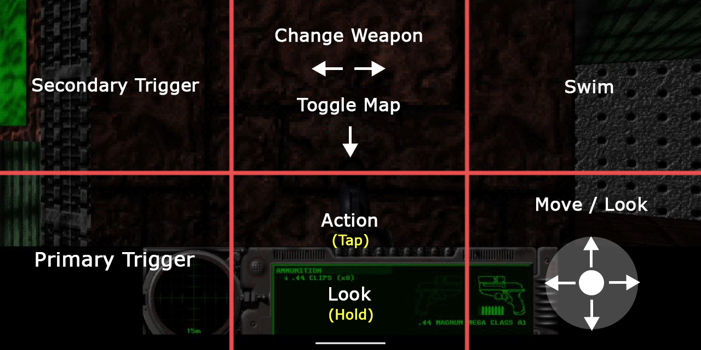

# AlephOne for Android

## What is this?
This is a port of the [AlephOne](https://alephone.lhowon.org/) engine to Android.
Yes, this means you can now play the Marathon saga on your Android phone! :robot:
You can even play online!

## How to run
Download the APK of the desired chapter from the [releases](https://github.com/daniele-rapagnani/alephone-android/releases) page from your phone and install it.
Your phone may complain about the APKs signature as it is not registered with the Google Play Store, simply ignore the warnings. Enjoy!

## How to play

The game supports playing with a bluetooth keyboard and/or a bluetooth **joystick** (such as a PS4 controller).
In both cases you can configure your input from the preferences screen.

If you want you can also play using touch controls.
There are no on-screen controls for now, here's how they work:



You can find some options in the preferences to tune your touch experience by adjusting dead zones and the virtual stick size.

## Scenarios

The game supports playing scenarios but you have to do a bit of work by following these instructions:
- Place a file called `AlephOneScenario.txt` in the root of your phone's storage.
- Place the scenario you want to play somewhere on your phone.
- Write the path to the root folder of the scenario as the first line of `AlephOneScenario.txt`, such as `/sdcard/Evil`. If you are not sure what your path is, try `/sdcard/Your Scenario Folder` or `/mnt/sdcard/Your Scenario Folder`
- Make sure the AlephOne you are going to use **is authorized** to access storage. Considering that the app is not signed some phones will deny access to storage without asking. Check in your phone's settings.
- Run any of the games (M1/M2/MI), the scenario should run instead.

At the moment be sure to put your scenarios in your phone's memory. Putting them on an SD card will probably not work because the app has no write access to the SD card. This maybe confusing because the path to your phone's **internal** storage will probably still be `/sdcard`. Don't worry about that.

Save games for the scenario will be placed inside the scenario's folder and will be separate from the main game(s).

If you want to go back to playing the bundled game you don't need to delete the `AlephOneScenario.txt` file, you can simply put a `#` in front of the scenario path to disable it, such as: `#/sdcard/Evil`.

## Contributing

### Dependencies
All dependencies are included in this project. 
The only requirement is that you probably want to use the __Android NDK 18b__ or lower to build the project because of a bug in newer versions. If you don't do this the game will crash on startup complaining about not finding the main `.so` library (in the adb log).

You can still build the project with the latest NDK version but you'll need to patch it.
You can find the patch [here](https://android-review.googlesource.com/changes/platform%2Fndk~1318770/revisions/1/patch?zip.).
For further information on the issue take a look at [this issue](https://github.com/android/ndk/issues/929). The issue seems fixed in the latest NDK 22 but the project doesn't support it at the moment.

### Compiling
Just clone the repository with:

```sh
git clone --recursive git@github.com:daniele-rapagnani/alephone-android.git
```

Then import the project in Android Studio or run the assemble task with:

```sh
# Use app:assembleRelease instead if you want the release build
./gradlew app:assembleDebug
```

This will build all three chapters of the game.
If you want just one you can build the corresponding flavor:

```sh
./gradlew app:assembleMarathon2Release
```
